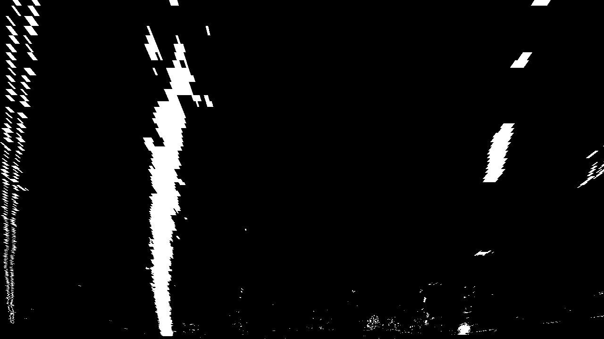
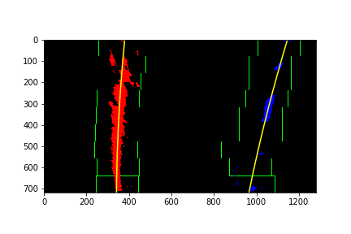

# **Advanced Lane Finding Project**
---

The goals / steps of this project are the following:

* Compute the camera calibration matrix and distortion coefficients given a set of chessboard images.
* Apply a distortion correction to raw images.
* Use color transforms, gradients, etc., to create a thresholded binary image.
* Apply a perspective transform to rectify binary image ("birds-eye view").
* Detect lane pixels and fit to find the lane boundary.
* Determine the curvature of the lane and vehicle position with respect to center.
* Warp the detected lane boundaries back onto the original image.
* Output visual display of the lane boundaries and numerical estimation of lane curvature and vehicle position.

---

In the following discussion I will consider the [rubric points](https://review.udacity.com/#!/rubrics/571/view) individually and describe how I addressed each point in my implementation. The link to my GitHub repository can be found [here](https://github.com/urs-waldmann/CarND-Advanced-Lane-Lines).

---

## Camera calibration using chessboard images

The code for this step is contained in the first code cell in section "Camera calibration using chessboard images" of the IPython notebook located in "./adv_lane_fin.ipynb". I used the code provided by Udacity in the IPython notebook located in "./examples/example.ipynb".  

The code starts by preparing "object points", which will be the (x, y, z) coordinates of the chessboard corners in the world. Here the code is assuming the chessboard is fixed on the (x, y) plane at z=0, such that the object points are the same for each calibration image.  Thus, `objp` is just a replicated array of coordinates, and `objpoints` will be appended with a copy of it every time the code successfully detects all chessboard corners in a test image.  `imgpoints` will be appended with the (x, y) pixel position of each of the corners in the image plane with each successful chessboard detection.
I added some code to save all successful or unsuccessful chessboard detections (at the moment this code is commented out). The images are located in "./output_images" and named calibrationX, where X runs from 1 to 20.
Here is an example image of an unsuccessful and a successful chessboard detection.

Unsuccessful chessboard detection:


Successful chessboard detection:


## Build an advanced lane line finding pipeline

In order to write a working pipline I first defined some helper functions that you can find in the sectin "Helper functions". I will discuss them in the sections where I used them.
In general I first built my pipeline step by step applying each step to the test images located in "./test_images". When I was satisfied with the current step I saved the modified test images in the folder "./output_images". All the code for saving test images is commented out at the moment.
In addition I added a visualization at the end of this section displaying every step on an example road image.

### Pipeline (single images)

#### 1. Distortion correction

For this purpose I defined the helper function called `cal_undistort()`. This helper function uses the `objpoints` and `imgpoints` to compute the camera calibration and distortion coefficients using the `cv2.calibrateCamera()` function. Then it applies this distortion correction to the test images called `img` using the `cv2.undistort()` function. Applying this helper function to one of the test images leads to this result:


In order to check wether the distortion correction is good enough I also performed an undistortion on a chessboard image for reference.

Distorted chessboard image:


Undistorted chessboard image:


#### 2. Thresholds

I used a combination of color and gradient thresholds to generate a binary image. Therefore I defined some helper functions in the section "helper functions". `abs_sobel_thresh()` computes the absolute value of the Sobel operator in x- or y- direction. Therefore the image `img` is converted into a grayscale image, the Sobel operator in x- or y-direction is performed and then the absolute value is taken. `mag_thresh()` computes the magnitude of the Sobel operator and works similarly to `abs_sobel_thresh()`. Only instead of taking the absolute value of the Sobel operator it computes the magnitude. Another helper function that works similarly is `dir_threshold()`. This function computes the direction of the Sobel operator. `rgb_threshold()` and `hls_threshold()` take in an image `img` and return only one of the three color channels of the original image. To get the best result I combined the color and gradient thresholds in different ways and experimented a little bit with them. I picked a logic combination of the R-, G-, H- & S-channel plus the absolute value of the Sobel operator in x- and y-direction for my final pipeline. Here's an example of my output for this step. The image is the same test image as displayed for distortion correction.

Binary road image:


#### 3. Perspective transform

The code for my perspective transform includes a function called `warper()`, which appears in the section "Helper functions" and which I took from Udacity's example folder, i.e. the code for my helper function `warper()` is from "./examples/example.py".  The `warper()` function takes as inputs an image (`img`), as well as source (`src`) and destination (`dst`) points. I chose to hardcode the source and destination points in the following manner:

```python
src = np.float32(
    [[585, 460],
    [695, 460],
    [203, 720],
    [1127, 720]])
dst = np.float32(
    [[320,0],
    [960,0],
    [320,720],
    [960,720]])
```

Thus the following source and destination points are:

| Source        | Destination   | 
|:-------------:|:-------------:| 
| 585, 460      | 320, 0        | 
| 695, 460      | 960, 0        |
| 203, 720      | 320, 720      |
| 1127, 720     | 960, 720      |

In Appendix A at the end of my IPython notebook I experimented with the points in order to achieve a good working result.
I verified that my perspective transform was working as expected by drawing the `src` and `dst` points onto a test image that has only straight lane lines and its warped counterpart to verify that the lines appear parallel in the warped image.


The lines are not perfectly parallel, especially if we use the same source and destination points for another test image that has only straight lane lines:


but the coice of source and destination points is good enough as we will see in the final project video.
For completeness here is the warped image of the same road image that I displayed in the other sections:



#### 4. Lane line pixels detection

The code of this section is from Udacity, lesson 13 - Project: Advanced Lane Finding, section 33: Finding the Lines. There is no helper function for this part of the code and the code itself can be found in the cell in section "Pipeline (single images)".
In order to detect the lane lines the code takes a histogram where it adds up the pixel values along each column in the image:
```python
histogram = np.sum(binary_warped[binary_warped.shape[0]//2:,:], axis=0)
```
It then identifies the two most prominent peaks in this histogram:
```python
midpoint = np.int(histogram.shape[0]/2)
leftx_base = np.argmax(histogram[:midpoint])
rightx_base = np.argmax(histogram[midpoint:]) + midpoint
```
and takes the position of them as a starting point for the left and right lane line. From that point, the code uses a sliding window, placed around the line centers, to find and follow the lines up to the top of the frame. At the end it fits a polynomial through the detected lane line pixels with `np.polyfit()` for the left and the right lane line pixels seperately. Here is the result of the test image that we also used previously to display our results. The detected pixels of the left and right lane line are red and blue respectively, the sliding window is shown in green and the polynomial fit of the left and right lane line is yellow.



#### 5. Radius of curvature

The code of this section is from Udacity, lesson 13 - Project: Advanced Lane Finding, section 35: Measuring Curvature. There is no helper function for this part of the code and the code itself can be found in the cell in section "Pipeline (single images)".
To measure the radius of curvature the code assumes the curves to be part of a perfect circle. Furthermore for the purpose of this project it is good enough to assume that the lane lines are about 30 meters long and 3.7 meters wide:
```python
ym_per_pix = 30/720
xm_per_pix = 3.7/640
```
To obtain the radius of curvature in real world space, i.e. meters, the code fits a new polynomial where it converts the image pixels in meters:
```python
left_fit_cr = np.polyfit(lefty*ym_per_pix, leftx*xm_per_pix, 2)
right_fit_cr = np.polyfit(righty*ym_per_pix, rightx*xm_per_pix, 2)
```
and calculates then the radius of curvature given by the equation in lesson 13 - Project: Advanced Lane Finding, section 35: Measuring Curvature:
```python
left_curverad = ((1 + (2*left_fit_cr[0]*y_eval*ym_per_pix + left_fit_cr[1])**2)**1.5) / np.absolute(2*left_fit_cr[0])
right_curverad = ((1 + (2*right_fit_cr[0]*y_eval*ym_per_pix + right_fit_cr[1])**2)**1.5) / np.absolute(2*right_fit_cr[0])
```
I then added a simple line of code where the final radius of curvature is calculated by taking the mean of the left and right lane radius of curvature:
```python
curverad = (left_curverad + right_curverad) / 2
```

#### 6. Project lane lines back on original road image

The code of this section is from Udacity, lesson 13 - Project: Advanced Lane Finding, section 36: Tips and Tricks for the Project. There is no helper function for this part of the code and the code itself can be found in the cell in section "Pipeline (single images)".
The code projects the detected lane lines back on the original image with the helper function `warper()`. This time the source and destination points are switched in order to get the inverse perspective transform matrix.
I added some code in order to write e.g. the radius of curvature on the final image with the function `cv2.putText()`.
Here is the final result of the test image:


## Pipeline (video)

#### 1. Provide a link to your final video output.  Your pipeline should perform reasonably well on the entire project video (wobbly lines are ok but no catastrophic failures that would cause the car to drive off the road!).

Here's a [link to my video result](./project_video.mp4)

---

### Discussion

#### 1. Briefly discuss any problems / issues you faced in your implementation of this project.  Where will your pipeline likely fail?  What could you do to make it more robust?

Here I'll talk about the approach I took, what techniques I used, what worked and why, where the pipeline might fail and how I might improve it if I were going to pursue this project further.  
